# AI Engineering Patterns in Distill
**Last Updated:** March 2026

A rundown of the AI/LLM patterns I've implemented in Distill, how they work, and where to find them in the codebase.

---

## 1. Architecture

### 1.1 Centralized LLM Dispatch
All AI calls route through one file: `task_router.py`. No other module imports LiteLLM or knows about model names/providers. This gives me a single point for routing, instrumentation, cost tracking, and prompt management.

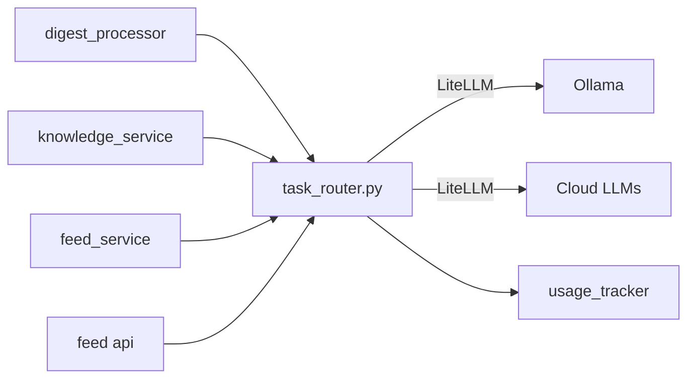

`backend/app/core/task_router.py`
- Functions: `summarize()`, `embed()`, `tag_topics()`, `rag_answer()`, `score_quality()`, `unpack_sections()`
- Callers (digest_processor, knowledge_service, feed_service) only call these functions

### 1.2 Adaptive Inference Routing with Fallback Chain
Local-first routing that tries Ollama, then cascades through cloud providers. Configured per task tier (heavy vs light) with three modes: `auto`, `cloud`, `local`.

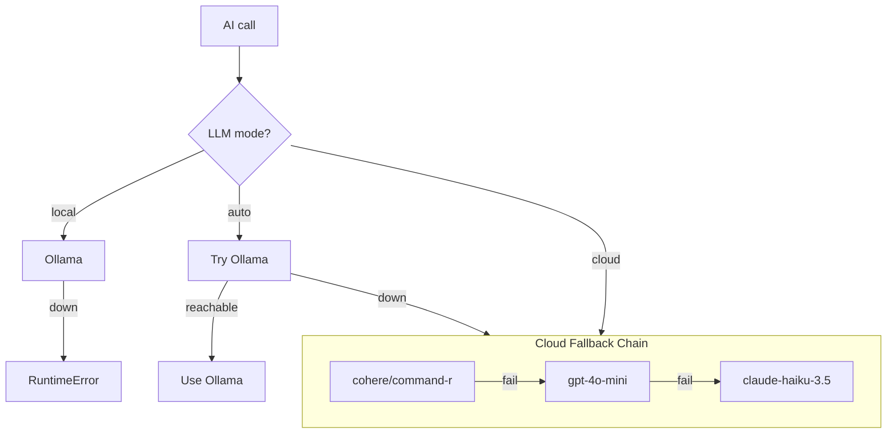

`backend/app/core/task_router.py`
- `_should_use_local(tier)` checks mode config + Ollama health
- `_cloud_completion(task_name, **kwargs)` tries cloud models in order, logs each attempt
- Two tiers: "heavy" (summarize, RAG, unpack) and "light" (tagging, scoring, embedding)

### 1.3 Background Processing with Status Tracking
Long-running LLM pipelines run as async background tasks. API endpoints return immediately. The frontend polls for progress.

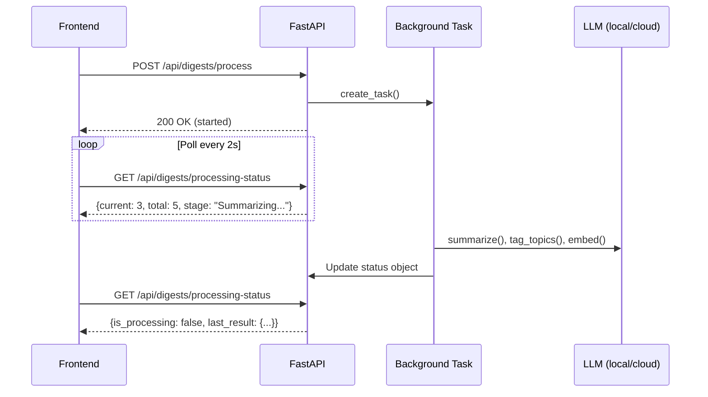

- `backend/app/services/digest_processor.py` — `start_processing_in_background()`
- `backend/app/services/knowledge_service.py` — `start_learn_now_in_background()`
- `backend/app/services/feed_service.py` — `start_fetch_in_background()`
- Each has a status object tracking: `is_processing`, `current`/`total`, `stage`, `llm_mode`

### 1.4 Debounced Auto-Processing
Captures trigger a deferred processing timer. Each new capture resets the timer (cancelable `asyncio.Task` with sleep). This avoids redundant pipeline runs when multiple items are captured in quick succession.

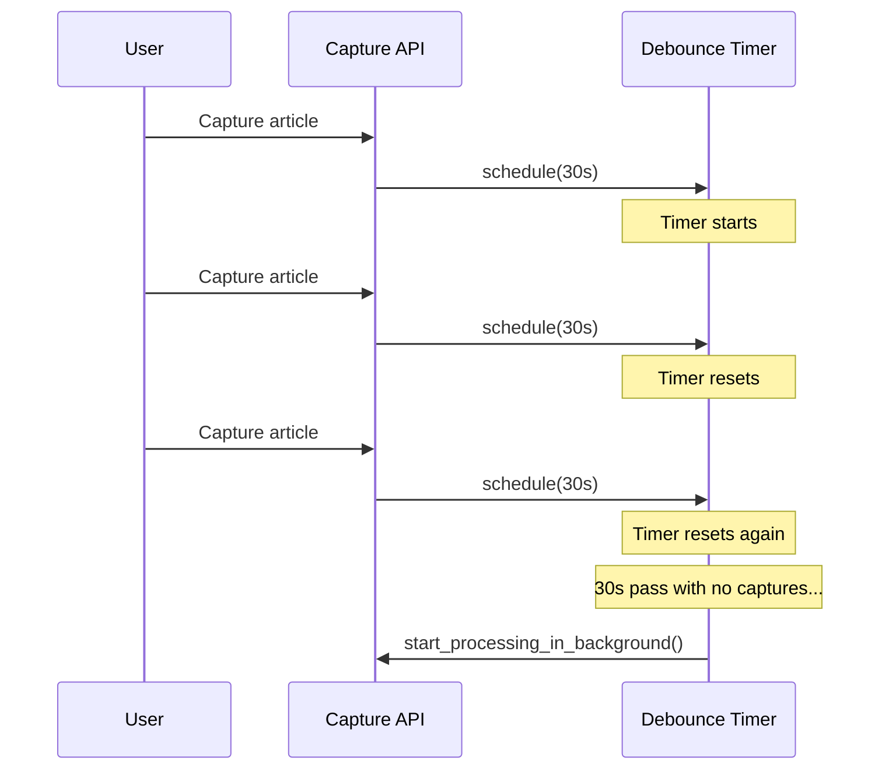

`backend/app/services/digest_processor.py` — `schedule_deferred_processing()`
- Configurable delay via `DIGEST_AUTO_PROCESS_DELAY_SECONDS` (default 30s)

---

## 2. RAG (Retrieval-Augmented Generation)

### 2.1 Full RAG Pipeline
End-to-end: chunk, embed, store, retrieve, augment, generate with citations.

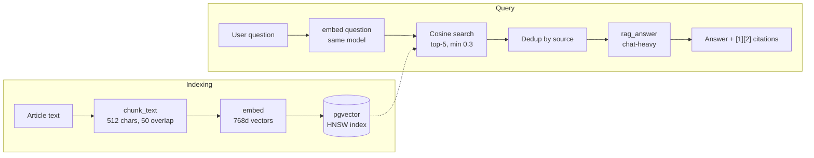

**Indexing path:**
1. Content chunked via `RecursiveCharacterTextSplitter` (512 chars, 50 overlap)
2. Chunks embedded via `embed()` (768d vectors)
3. Stored in pgvector with HNSW index

**Query path:**
1. Question embedded with same model (embedding consistency enforced by the single `embed()` entry point)
2. pgvector cosine similarity search, top-5 chunks, min similarity 0.3
3. Chunks deduplicated by source, formatted as `[Source N]: {text}`
4. `rag_answer()` generates a response with inline `[1][2]` citations + related questions

Relevant files:
- Indexing: `backend/app/services/knowledge_service.py`
- Retrieval + generation: `backend/app/api/rag.py`, `backend/app/core/task_router.py`
- Chunking: `backend/app/services/text_processing.py`

### 2.2 Conversation History in RAG
The client maintains ephemeral Q&A history (session-scoped, not persisted). It's sent with each query. The backend trims to ~4000 chars (whole exchanges, walking backward) and injects into the prompt. This enables follow-ups like "tell me more" without server-side session state.

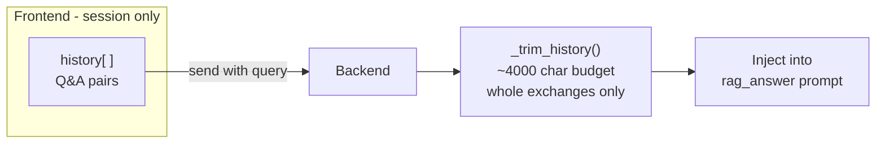

`backend/app/core/task_router.py` — `_trim_history()`

### 2.3 Embedding Consistency
Query and document embeddings must use the same model. I enforce this architecturally: a single `embed()` function is the only code path for all embedding. Both local (nomic-embed-text) and cloud (text-embedding-3-small) produce 768d vectors.

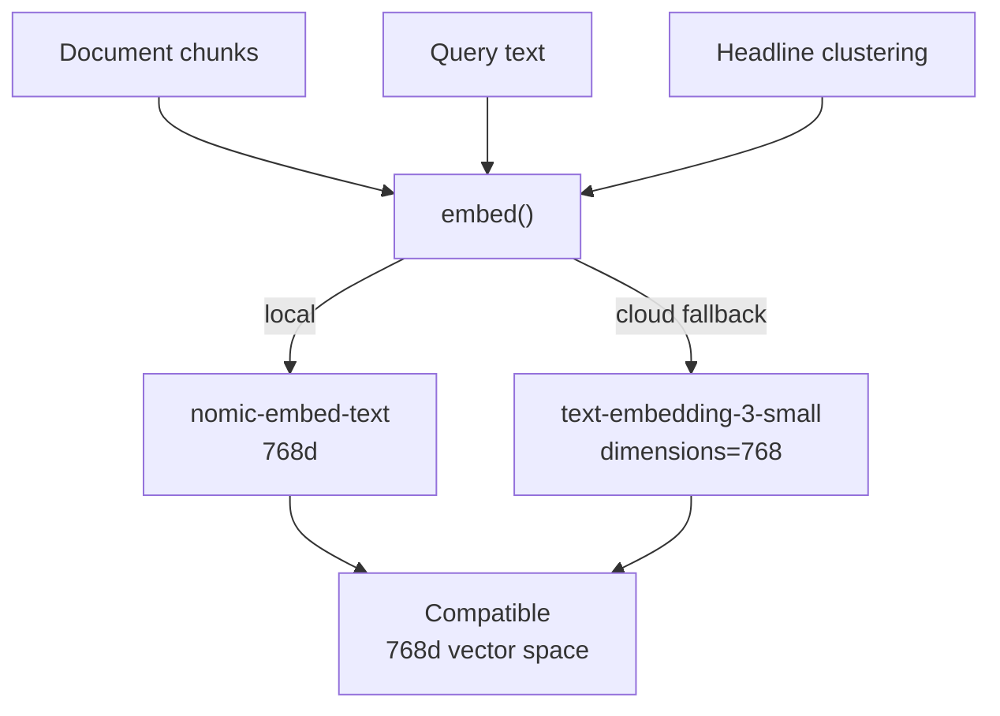

`backend/app/core/task_router.py` — `embed()`

---

## 3. Prompt Engineering

### 3.1 Structured JSON Output
All LLM calls that need structured data use `response_format={"type": "json_object"}` with explicit field definitions in the prompt. Parsed with `json.loads()` and validated.

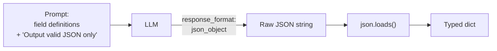

Used by: `summarize()`, `unpack_sections()`, `rag_answer()`, `tag_topics()`

### 3.2 Novelty-Biased Summarization
The prompts explicitly tell the model to skip common knowledge and surface what's novel, surprising, or contrarian. Bullets prioritize counterintuitive findings. Quotes prefer controversial or uniquely insightful selections.

`backend/app/core/task_router.py` — `summarize()` system and user prompts

### 3.3 User Context Injection (Focused Topics)
User-configured interest topics get injected into prompts at runtime. I cache them in memory and refresh at pipeline start. This affects summarization depth, topic tagging, and RAG answer bias.

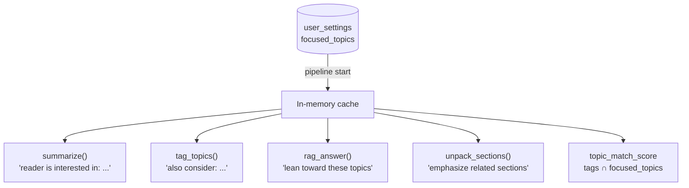

- Cache: `_focused_topics_cache` in `task_router.py`, refreshed by `refresh_focused_topics()`
- Injected into: `summarize()`, `unpack_sections()`, `tag_topics()`, `rag_answer()`
- Scoring: `topic_match_score` in feed items = count of tags intersecting focused topics

### 3.4 Progressive Summarization
Two-tier summarization for progressive drill-down:
- **Level 1:** `summarize()` produces headline + summary + bullets + quotes
- **Level 2:** `unpack_sections()` breaks content into 3-5 key sections with mini-summaries

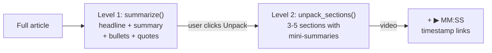

Both are topic-aware and video-aware (timestamps included when `is_video=True`).

### 3.5 Content Classification via Summarization
The `summarize()` prompt extracts structured metadata alongside the summary:
- `content_style` — one of 8 types: tutorial, demo, opinion, interview, news, analysis, narrative, review
- `information_density` — 1-10 scale rating substantive content density

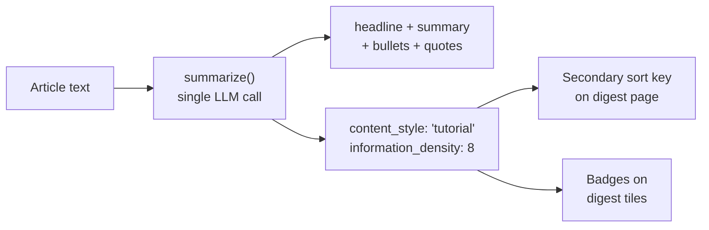

I use these for sorting (density as secondary sort key) and display (badges on digest tiles).

---

## 4. Content Intelligence

### 4.1 Video Demo Detection (Heuristic Fusion)
I classify YouTube videos as demos/tutorials using two independent signal sources, no LLM needed:
- **Transcript patterns:** 18 regex patterns detect demo cues ("as you can see", "let me show", "click on", etc.)
- **Description analysis:** Keyword matching for tutorial/demo signals + timestamp counting

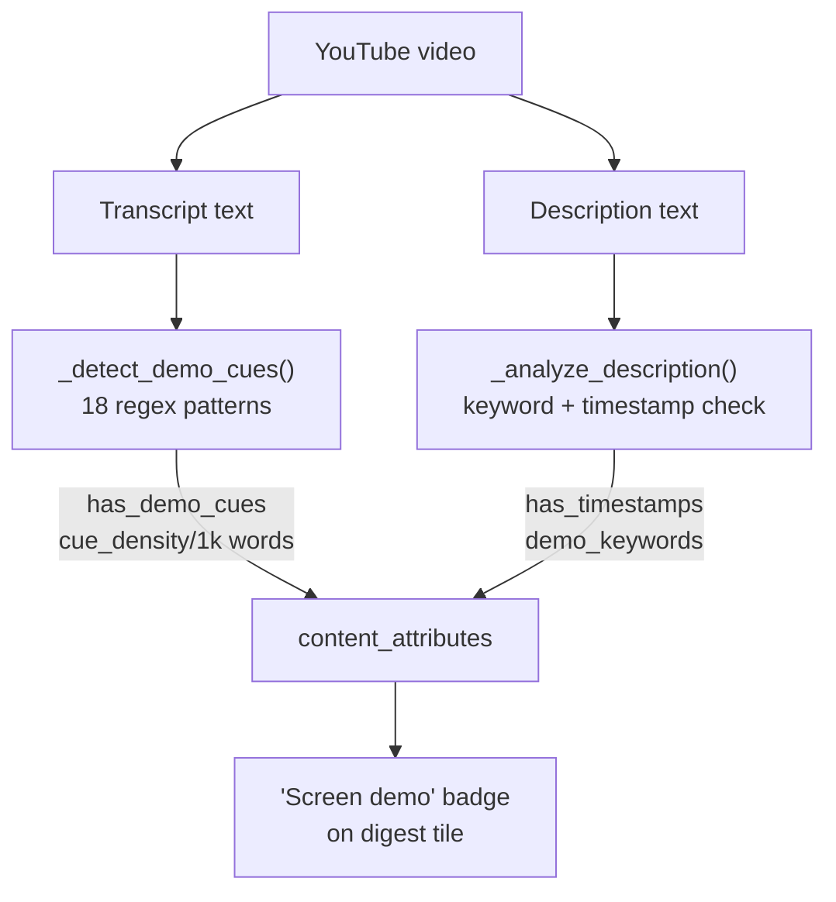

Outputs: `has_demo_cues`, `demo_cue_count`, `demo_cue_density` (per 1k words), `has_timestamps`

`backend/app/services/video_extractor.py` — `_detect_demo_cues()`, `_analyze_description()`

### 4.2 Vector Similarity Clustering
Groups related articles using cosine similarity on headline embeddings. Purely mathematical (numpy), no LLM cost. Multi-article clusters trigger merged re-summarization.

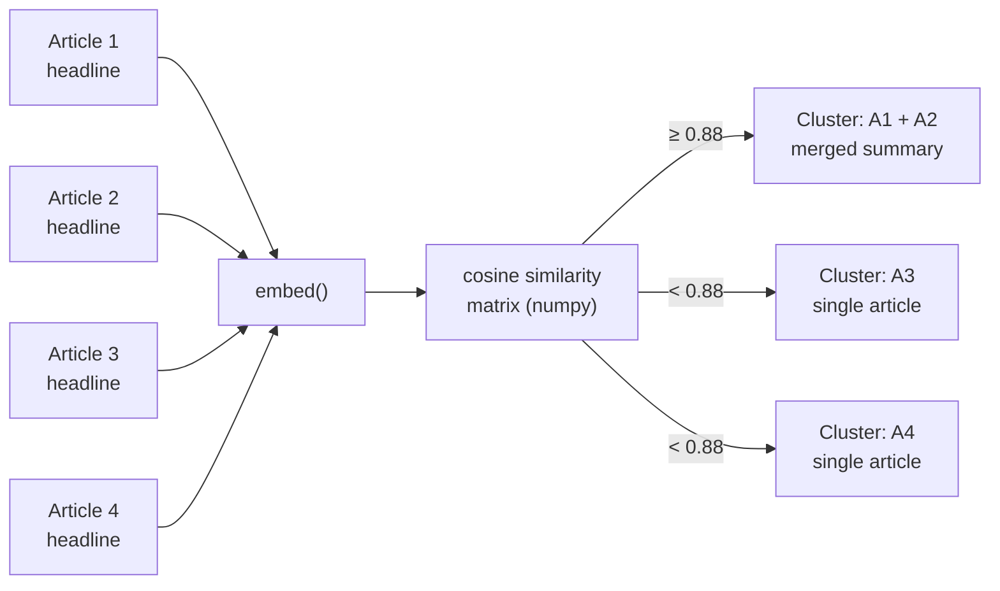

`backend/app/services/text_processing.py` — `cluster_by_similarity()` (threshold: 0.88)

### 4.3 Automated Topic Tagging
LLM-based classification into 1-3 topic labels from a predefined taxonomy, augmented with user-specific focused topics. Uses the light model tier for speed/cost.

`backend/app/core/task_router.py` — `tag_topics()`

### 4.4 Content-Aware Extraction Routing
URL dispatcher that routes to specialized extractors based on content type:
- Articles: httpx + readability-lxml
- YouTube: youtube-transcript-api + metadata scraping
- (Future) PDFs, newsletters

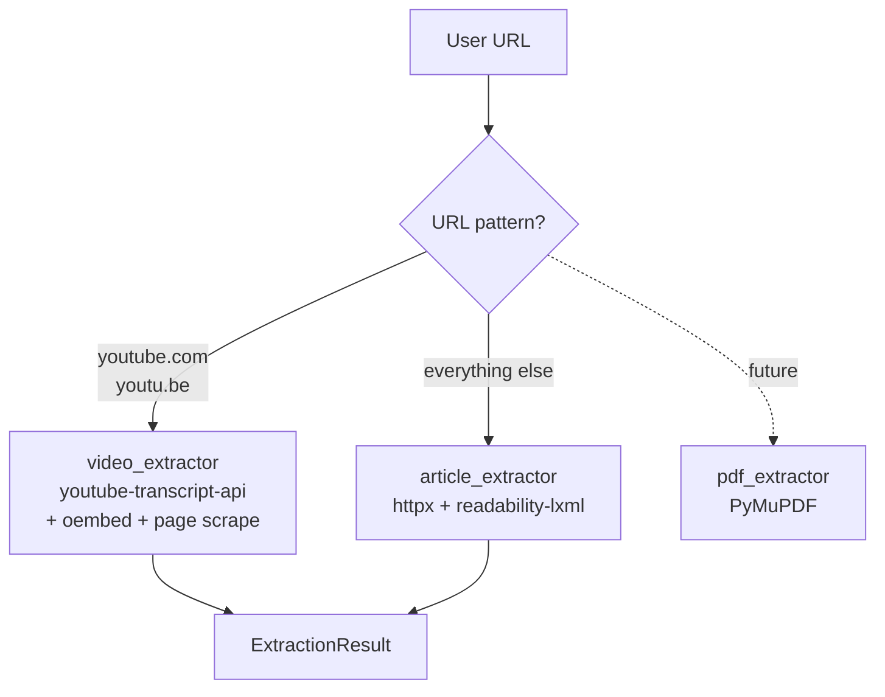

`backend/app/services/content_extractor.py` — `extract_content()`

---

## 5. Observability and Cost Management

### 5.1 LLM Usage Tracking with Cost Attribution
Every LLM call records: task type, model, provider (local/cloud), input/output tokens, cost (USD). I buffer these in memory and flush to DB every 60s. Cloud costs are calculated via LiteLLM's `completion_cost()`, local costs are $0.

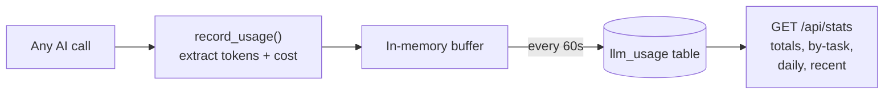

`backend/app/core/usage_tracker.py`

### 5.2 Provider Telemetry
Tracks which provider is active (local vs cloud) and whether inference is in flight. "Sticky" mode: once cloud is used in a pipeline run, it stays cloud. Exposed via API so the frontend can show "running locally" vs "using cloud".

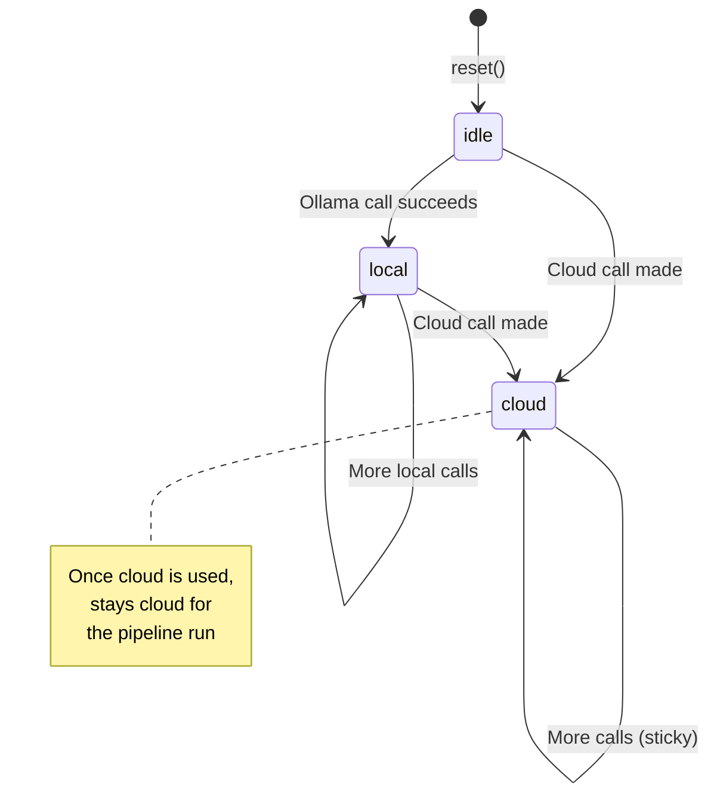

`backend/app/core/task_router.py` — `LLMTracker` class

---

## 6. Resilience

### 6.1 Graceful Degradation
Every AI function has fallback behavior when inference fails:
- Failed tagging defaults to `["General"]`
- Failed scoring defaults to `7`
- Failed local inference falls back to cloud (in auto mode)
- Failed cloud inference cascades through the fallback chain
- Missing content filled with safe defaults

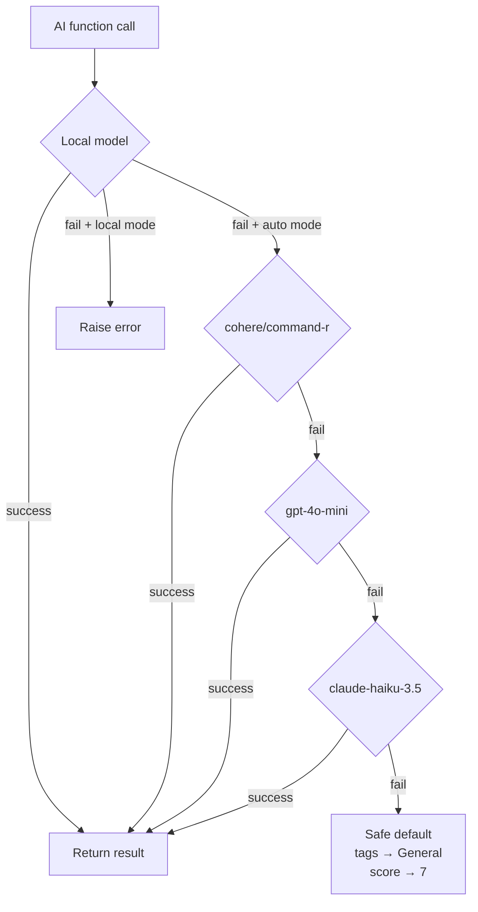

### 6.2 Friendly Error Translation
Verbose extraction errors (YouTube transcript failures, timeouts, 403s) get mapped to concise user-facing messages before returning to the frontend.

`backend/app/api/feed.py` — `_friendly_extraction_error()`

### 6.3 On-Demand Summarization with DB Caching
Feed items are summarized on demand, not upfront. Results are cached on the `feed_items` row. Subsequent requests return instantly from cache.

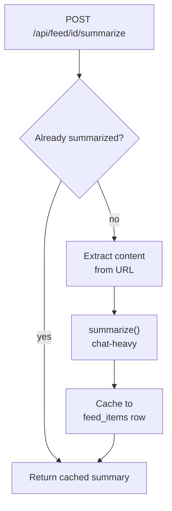

`backend/app/api/feed.py` — `POST /api/feed/{id}/summarize`

---

## 7. Security

### 7.1 SSRF Protection
All outbound HTTP requests to user-provided URLs are validated against private/reserved IP ranges. URLs are reconstructed from parsed components to break taint flow for static analysis tools.

`backend/app/core/security.py` — `validate_url()`

### 7.2 Log Injection Prevention
User-controlled input (URLs, titles, source names) is sanitized before logging. I use `%s` formatting (not f-strings) with `sanitize_log()` to strip newlines, carriage returns, and ANSI escapes.

`backend/app/core/security.py` — `sanitize_log()`

---

## 8. Not Yet Implemented

| Pattern | Description | Complexity |
|---------|-------------|------------|
| **Agentic Workflow** | Multi-step reasoning chain: extract claims, check KB for novelty, rate relevance, score quality, rank | High |
| **Chain-of-Thought** | Add "think step by step" reasoning to quality scoring and content evaluation | Low |
| **Few-Shot Prompting** | Include example summaries in prompts to improve output consistency | Low |
| **KB-Aware Novelty** | Query KB before summarizing to suppress already-known information (shelved in PRD S10) | Medium |
| **Hybrid Vector Search** | Combine cosine similarity with metadata filters (topic, date, content type) in RAG retrieval | Medium |
| **Quality Gate Pipeline** | Reject low-scoring summaries and re-summarize with different prompts or models | Low |
| **Reflection/Self-Critique** | LLM reviews its own output and refines before returning | Medium |
| **Tool Use** | Give the LLM access to tools (web search, calculator, KB query) during RAG answering | High |
